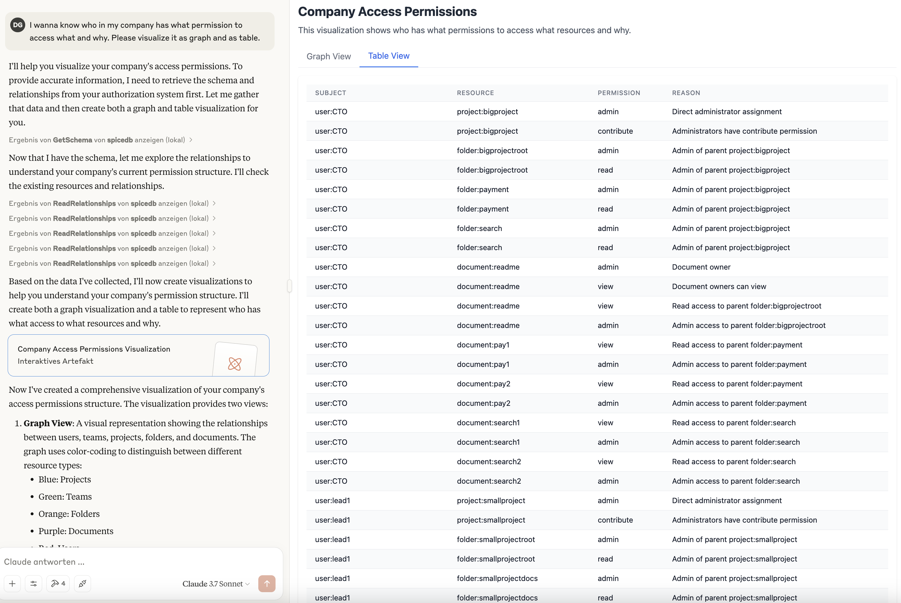
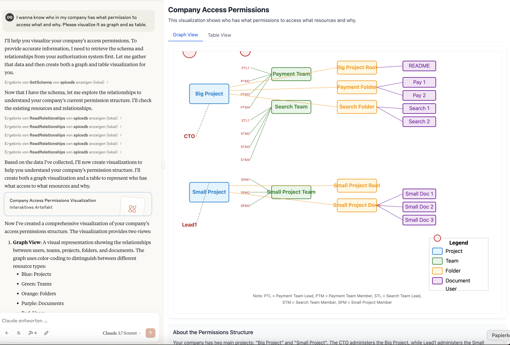

# SpiceDB MCP-Server
This is a highly experimental Model Context Protocol Server to let your llm use [SpiceDB](https://github.com/authzed/spicedb) 
to answer access- and before the fact audit-related questions (as defined by NIST in [this PDF](https://nvlpubs.nist.gov/nistpubs/specialpublications/nist.sp.800-162.pdf), Section 3.1.2.3).
It spins up an example spicedb environment using docker compose, and then uses the MCP-C#-SDK and the SpiceDB-C#-SDK to call `LookupSubjects`, `LookupResources`, `ReadRelationships` and `CheckBulkPermissions` under the hood.
I used Claude Desktop as MCP client, so you'll need a (free) account there, too, or use another client.

## Accompanying Blogpost
You can find the accompanying Post [here](https://www.innoq.com/en/articles/2025/04/journey-into-ai-mcp/), walking you through the implementation, and adds some lessons learned. There are also some more broad [thoughts on MCP security](https://www.innoq.com/en/articles/2025/04/journey-into-ai-mcp/#mythoughtsonmcpsecurity) at the bottom you might find interesting. Feel free to reach out if you want to talk.

## What it does
Here you can see an example of the output using Claude Desktop (this was done while developing, 
might not resemble the latest execution paths. Then again, determinism is not guaranteed altogether with AI, so who cares ;-) ):
### Table view:

### Graph view:


## Running the Code
- Install .net 9
- `cd SpiceDB-MCP` and there, use `dotnet run` to start the code once. then break using e.g. ctrl+c.
- add the appropriate config for Claude dekstop to integrate the server.
### Claude config
You need to integrate the MCP server into Claude. On MacOS, you need a file `claude_config.json` located in `~/Library/Application\ Support/Claude/`. 
If the file does not exist, create it. Then post / add the following json - change the Path to where the solution is located, for me it's for example `/Users/dguhr/git/dguhr/SpiceDB-MCP/SpiceDB-MCP`. 
```json
{
    "mcpServers": {
        "spicedb": {
            "command": "dotnet",
            "args": [
                "run",
                "--project",
                "/PATH/TO/SOLUTION",
                "--no-build"
            ],
            "env": {
                "SPICEDB_PSK": "testkey"
            }
        }
    }
}
```
> [!CAUTION]
> As of now this project uses the `MCP C#-SDK v0.1.0-preview.2` NuGet-Package. This package has a bug (or, maybe, the claude desktop client - see this [Issue](https://github.com/modelcontextprotocol/csharp-sdk/issues/148) I created), so the spawned dotnet-processes DO NOT GET TERMINATED correctly. So after using, you want to run `ps aux | grep dotnet` or similar and kill the spawned dotnet processes.

### Starting up a local SpiceDB environment with Model and Schema
The docker-compose.yaml loads the schema and test relations from the `bootstrap` folder, so all you need to do is
```zsh
docker compose --env-file .env up -d
```

### Startup
Start [Claude desktop](https://claude.ai/download) (free version suffices, you'd need an account though) as MCP client 
(or use another one, which is the nice part ;-)). 

Ask e.g. the following questions: 
* who has access to document pay1?
* What documents does the CTO have access to?
* Who has access to search2?
* Has smallteammember1 read-access to smallprojectdoc3 and smallprojectdoc1?
* I wanna know who in my company has what permission to access what and why. Please visualize it as graph and as table.

Note that especially for the last question, the LLM often wants to use ReadRelationships and GetSchema only. 
I tried to mitigate that behaviour, but it still uses it a lot. Any description improvements are welcome ;-) 
Also note that sometimes it has problems creating a react-based graph (when it uses react). Indeterminism hooray.
You can surely create a better prompt, telling it what library to use etc. - I'll leave that as an exercise for the reader.

p.s. Keep in mind this is an experiment, so the model may not be fully great. Didn't put much thought into it. You can change it with your model/relations by changing the contents of the yaml files in the `bootstrap` directory.

### ZED CLI-usage
If you wanna use zed, install zed locally - see [docs](https://authzed.com/docs/spicedb/getting-started/installing-zed).

then set the context:
`zed context set dev :50051 "testkey" --insecure`

then use it: 
`zed context use dev`

and make some calls, e.g. get the schema:
`zed schema read`

or get all members of a team:
`zed permission lookup-subjects team:smallprojectteam member user`

or get everyone who has access to a document:
`zed permission lookup-subjects document:pay1 view user`

or check which documents a user has access to:
`zed permission lookup-resources document view user:CTO`

### Change code and see changes take effect
If you wanna build something out of this, make sure you run "dotnet run" in your console of choice after you made your changes, 
and restart Claude Desktop so it takes the new Version into account. This workflow feels bumpy, and I hope it gets improved in the future. 
